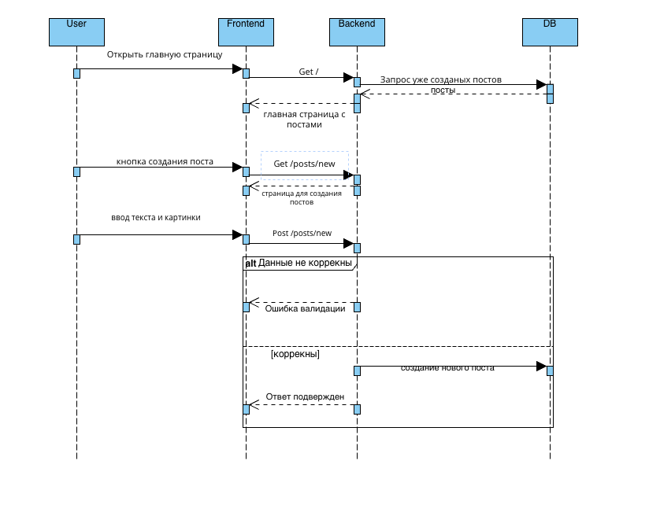
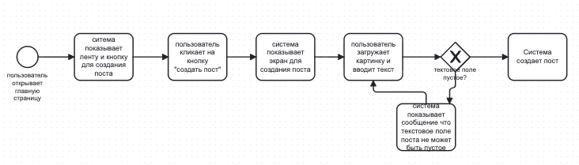
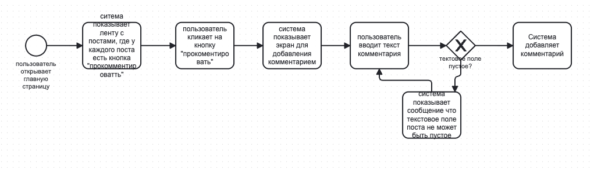

# Lab 4

## 1. Диаграмма последовательностей: создание поста (image.png)

Участники: User, Frontend, Backend, DB.

Основной поток:
1. Пользователь открывает главную страницу.
2. Frontend делает `GET /` на Backend.
3. Backend запрашивает у DB уже созданные посты.
4. Frontend отображает главную страницу с постами.
5. Пользователь нажимает кнопку создания поста.
6. Frontend делает `GET /posts/new` на Backend.
7. Frontend отображает страницу создания поста.
8. Пользователь вводит текст и картинку.
9. Frontend отправляет `POST /posts/new` на Backend.

Альтернативный поток (валидация):
- Если данные некорректны, Backend отвечает ошибкой валидации.
- Если данные корректны, Backend создает новый пост в DB и возвращает подтвержденный ответ.

## 2. Процесс создания поста (create_post.png)

Сценарий:
1. Пользователь открывает главную страницу.
2. Система показывает ленту и кнопку "создать пост".
3. Пользователь кликает кнопку "создать пост".
4. Система показывает экран создания поста.
5. Пользователь загружает картинку и вводит текст.
6. Проверка: текстовое поле пустое?
   - Да: система показывает сообщение, что поле текста не может быть пустым, пользователь возвращается к вводу.
   - Нет: система создает пост.

## 3. Процесс добавления комментария (create_comment.png)

Сценарий:
1. Пользователь открывает главную страницу.
2. Система показывает ленту, у каждого поста есть кнопка "прокомментировать".
3. Пользователь кликает кнопку "прокомментировать".
4. Система показывает экран для добавления комментария.
5. Пользователь вводит текст комментария.
6. Проверка: текстовое поле пустое?
   - Да: система показывает сообщение, что поле текста не может быть пустым, пользователь возвращается к вводу.
   - Нет: система добавляет комментарий.
